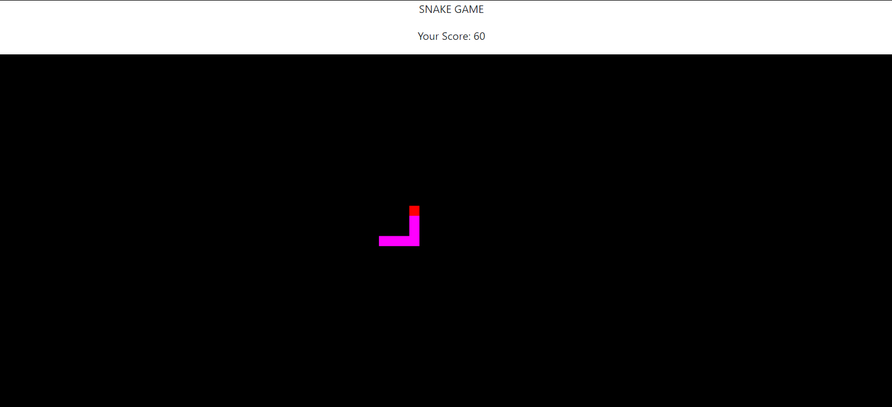

# SnakeGameJs

Classic Snake Game in Js only

## Technology Used
1: Boostrap 4 :- Front end css frame work for styling(although use in this project is very less,but more use will be in upcoming future version.)

2:Phasor :- A web base js library use for developing games.

3:node.js :- A js backend framework ,for serving files.

### How to run

just clone the this repo into your local machine,have node installed,run '''npm install''' and then open 'localhost:3000' in your browser.

### For sample 
best,click the preview link or 
see the 2 images included in files.

### screenshots

feel free to contribute.

### I am working on more features like sound effects,saving high scores and more ....stay tuned...😎
